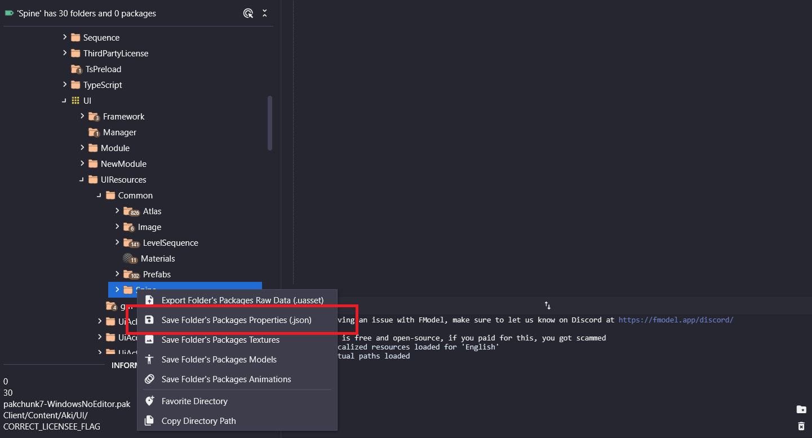

# Wuwa Spine
Script to convert l2d (spine) for [Wuthering Waves](https://wutheringwaves.kurogames.com).

# How to use:
- Command: `WuwaSpine.exe <path/to/spine/folder>`.
- Dumped package properties of spine folders are required.

- List of `UIResources` subfolders with spine assets (up to 2.1):
  - `Common\Spine`
  - `UICg\Spine`
  - `UiActivity\Spine`
  - `UiLuckDraw\Spine`

